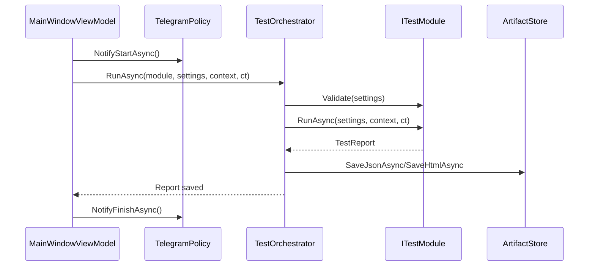

# WebLoadTester

> **English TL;DR (кратко):** Desktop UI/HTTP/Network test runner on .NET + Avalonia + Playwright. Provides 10 built-in modules (UI сценарии/скриншоты/тайминги, HTTP проверки/нагрузка/ассеты, сетевые и security проверки). Generates JSON + HTML reports and supports Telegram notifications (text). All details below are sourced from the repository.

## 1. Что это и для чего
**WebLoadTester** — настольное приложение для запуска UI/HTTP/сетевых проверок и получения отчётов с метриками (перцентили, ошибки, топ медленных) на основе .NET + Avalonia + Playwright. Проект предназначен для повторяемых прогонов сценариев и сетевых проверок, а также для ручного анализа отчётов (JSON/HTML). Реализованные сценарии — это **10 модулей** с собственными настройками и результатами. Точка входа: `Program.cs`, UI: `MainWindow.axaml`.

## 2. Для кого (персоны)
- **QA-инженеры** — быстрые UI/HTTP/сетевые прогоны с фиксируемыми отчётами и метриками.
- **DevOps/SRE** — проверка доступности, TCP/TLS/DNS диагностика, базовые security-проверки.
- **Сисадмины** — ручной инструмент для сетевых проверок узлов и TLS-сертификатов.
- **ИТ-отдел/поддержка** — оперативные «preflight» проверки перед релизом.
- **Разработчики** — единый UI для проверок HTTP/ассетов/сценариев и поиска регрессий.

## 3. Ключевые возможности (строго по коду)
- 10 модулей тестирования (UI/HTTP/Network/Security) с настраиваемыми параметрами и валидацией. (`Modules/*`)
- Генерация **JSON** и **HTML** отчётов с метриками (p50/p95/p99 и др.). (`Core/Services/ReportWriters/*`)
- Скриншоты UI в модулях, использующих Playwright. (`Modules/UiScenario`, `Modules/UiSnapshot`)
- Ограничения нагрузки (конкурентность и RPS) через `Limits`. (`Core/Domain/Limits.cs`)
- Telegram-уведомления о старте/прогрессе/финише/ошибке (только текст). (`Infrastructure/Telegram/*`)
- UI с вкладками модулей + живой лог + вкладка отчётов. (`Presentation/Views/*`)

## 4. Демонстрационный сценарий (5–10 шагов)
1. Клонируйте репозиторий.
2. Проверьте, что установлен **.NET SDK 8.0** (см. `WebLoadTester.csproj`).
3. Соберите проект: `dotnet build`.
4. Установите браузеры Playwright в локальную папку `./browsers` рядом с бинарниками. **TODO/Не найдено в коде:** конкретная команда установки в проекте не зафиксирована; стандартный для .NET Playwright сценарий — запуск скрипта `playwright.ps1` из папки сборки.
5. Запустите приложение: `dotnet run`.
6. В UI откройте вкладку **UI тестирование** или **HTTP тестирование**, выберите модуль и заполните настройки.
7. Нажмите **Старт** — лог начнёт заполняться, статус и прогресс обновятся.
8. Перейдите на вкладку **Отчёты** и откройте HTML-отчёт.
9. При необходимости настройте Telegram (справа) и повторите запуск — будут отправлены уведомления.

## 5. Технологии и требования
- **.NET**: `net8.0` (см. `WebLoadTester.csproj`).
- **Avalonia**: 11.3.10 (`Avalonia`, `Avalonia.Desktop`, `Avalonia.Themes.Fluent`, `Avalonia.Fonts.Inter`).
- **Playwright**: 1.57.0 (`Microsoft.Playwright`).
- **Telegram**: в проекте есть `Telegram.Bot` 22.7.6, но в коде используется собственный HTTP-клиент (`Infrastructure/Telegram/TelegramNotifier.cs`). **TODO/Не найдено в коде:** прямое использование `Telegram.Bot`.
- **ОС**: приложение — Avalonia Desktop; явные платформенные ограничения в коде не зафиксированы. **TODO:** документировать проверенные ОС.

## 6. Быстрый старт (с нуля)
```bash
git clone <repo>
cd WebLoadTester

dotnet restore
dotnet build
dotnet run
```
**Playwright-браузеры:**
- Приложение ожидает браузеры в папке `./browsers` **рядом с бинарником** (`AppContext.BaseDirectory`). (`Infrastructure/Playwright/PlaywrightFactory.cs`)
- **TODO/Не найдено в коде:** точная команда установки браузеров. Обычно используется скрипт Playwright из каталога сборки.

**Артефакты и логи:**
- JSON/HTML отчёты: `./reports/`.
- Скриншоты: `./screenshots/<runId>/`.
- Лог отображается в UI (канал `LogBus`).

## 7. Архитектура (высокоуровнево)
**Слои и зависимости:**
- **Presentation** (Avalonia UI, ViewModels/Views) → использует **Core** и **Modules**.
- **Modules** (10 модулей тестирования) → используют **Core** и **Infrastructure**.
- **Core** (контракты, доменные модели, оркестратор, метрики) — основа.
- **Infrastructure** (Playwright/HTTP/Network/Storage/Telegram) — внешние интеграции.

**Основной pipeline выполнения теста:**
1. `MainWindowViewModel.StartAsync` создаёт `RunContext` и `TestOrchestrator`.
2. `TestOrchestrator.RunAsync` валидирует настройки модуля.
3. `ITestModule.RunAsync` выполняет тест, собирает `ResultBase`-результаты.
4. `MetricsCalculator` считает метрики (avg/min/max/p50/p95/p99 и т.д.).
5. `JsonReportWriter` + `HtmlReportWriter` сохраняют отчёты через `ArtifactStore`.
6. UI обновляет прогресс через `ProgressBus` и лог через `LogBus`.

**Start/Stop и CancellationToken:**
- `StartAsync` создаёт `CancellationTokenSource` и передаёт токен в модуль.
- `Stop` вызывает `Cancel()`; модули уважают `CancellationToken` в циклах/ожиданиях.

**Лог в UI:**
- `LogBus` пишет строки в `Channel<string>`.
- `ReadLogAsync` читает канал и добавляет строки в `LogEntries` через Dispatcher UI.

**Формирование TestReport:**
- Базовый отчёт формирует `TestOrchestrator` (метаданные, OS, версия приложения, снимок настроек).
- Модуль заполняет `Results`, `FinishedAt` и статус.

## 8. Структура репозитория
```
/Assets
/Core
  /Contracts        # ITestModule, IRunContext, IArtifactStore, ILogSink...
  /Domain           # TestReport, ResultBase, Limits, Enums...
  /Services         # TestOrchestrator, ModuleRegistry, LogBus, ProgressBus, Metrics...
/Infrastructure
  /Http             # HttpClientProvider
  /Network          # DNS/TCP/TLS probes
  /Playwright       # PlaywrightFactory (browsers path)
  /Storage          # ArtifactStore (reports/screenshots/profiles)
  /Telegram         # TelegramPolicy, TelegramNotifier
/Modules
  /Availability     # net.availability
  /HttpAssets        # http.assets
  /HttpFunctional    # http.functional
  /HttpPerformance   # http.performance
  /NetDiagnostics    # net.diagnostics
  /Preflight         # net.preflight
  /SecurityBaseline  # net.security
  /UiScenario        # ui.scenario
  /UiSnapshot        # ui.snapshot
  /UiTiming          # ui.timing
/Presentation
  /Common            # AutoScrollBehavior
  /ViewModels        # MainWindow, Settings, Tabs
  /Views             # MainWindow, Tabs, SettingsViews
App.axaml            # темы + DataTemplates
Program.cs           # entry point
WebLoadTester.csproj # зависимости/TargetFramework
```

## 9. МОДУЛИ (10 штук) — подробности
Ниже перечислены все модули, их Id (как в коде), настройки и поведение.

### 9.1 UI сценарий
- **Id:** `ui.scenario` (`Modules/UiScenario/UiScenarioModule.cs`)
- **Цель:** запуск последовательных UI-шагов через Playwright.
- **Настройки (`UiScenarioSettings`):**
  - `TargetUrl`, `TotalRuns`, `Concurrency`, `Headless`, `ErrorPolicy` (`StepErrorPolicy`), `Steps`, `ScreenshotAfterScenario`.
  - `Steps`: `Selector`, `Action` (`WaitForVisible/Click/FillText`), `Text`, `TimeoutMs`.
- **Pipeline:**
  1. Проверка параметров.
  2. Проверка наличия браузеров (иначе ошибка).
  3. Параллельные прогоны с ограничением `Min(Concurrency, Limits.MaxUiConcurrency)`.
  4. Для каждого прогона: `Goto`, выполнение шагов, опционально скриншот.
- **Артефакты:** скриншоты `run_<index>.png` в папке `screenshots/<runId>/`.
- **Метрики:** по `RunResult` (успех, duration, ошибка). p50/p95/p99 и TopSlow рассчитываются автоматически.
- **Типичные кейсы:** регрессия UI, smoke-сценарии; полезно QA/разработчикам.

### 9.2 UI снимки
- **Id:** `ui.snapshot` (`Modules/UiSnapshot/UiSnapshotModule.cs`)
- **Цель:** массовое снятие скриншотов списка URL.
- **Настройки (`UiSnapshotSettings`):** `Urls`, `Concurrency`, `WaitMode` (`load`/`domcontentloaded`), `DelayAfterLoadMs`.
- **Pipeline:**
  1. Проверка списка URL.
  2. Playwright → параллельные заходы на каждый URL.
  3. Скриншот каждой страницы, имя `snapshot_<sanitized_url>.png`.
- **Артефакты:** скриншоты в `screenshots/<runId>/`.
- **Метрики:** `RunResult` на URL.
- **Кейсы:** визуальные сравнения, быстрые проверки доступности UI.

### 9.3 UI тайминги
- **Id:** `ui.timing` (`Modules/UiTiming/UiTimingModule.cs`)
- **Цель:** измерение времени загрузки страниц.
- **Настройки (`UiTimingSettings`):** `Urls`, `RepeatsPerUrl`, `Concurrency`, `WaitUntil` (`load`/`domcontentloaded`).
- **Pipeline:**
  1. Генерация пар (URL × итерации).
  2. Параллельные заходы и замеры времени `page.Goto`.
- **Артефакты:** скриншоты не создаются.
- **Метрики:** `TimingResult` (iteration, url, duration).
- **Кейсы:** контроль производительности UI, SLA по загрузке.

### 9.4 HTTP функциональные проверки
- **Id:** `http.functional` (`Modules/HttpFunctional/HttpFunctionalModule.cs`)
- **Цель:** точечные проверки HTTP-эндпоинтов с ассерциями.
- **Настройки (`HttpFunctionalSettings`/`HttpEndpoint`):**
  - `Endpoints`: `Name`, `Url`, `Method`, `Headers`, `Body`, `StatusCodeEquals`, `MaxLatencyMs`, `HeaderContainsKey`, `HeaderContainsValue`, `BodyContains`.
  - `TimeoutSeconds`.
- **Pipeline:** последовательный обход эндпоинтов, запросы `HttpClient`.
- **Артефакты:** нет.
- **Метрики:** `CheckResult` (status code, latency, asserts).
- **Кейсы:** API health checks, базовые регрессии контрактов.

### 9.5 HTTP производительность
- **Id:** `http.performance` (`Modules/HttpPerformance/HttpPerformanceModule.cs`)
- **Цель:** нагрузочный HTTP-тест с конкурентностью и RPS-лимитом.
- **Настройки (`HttpPerformanceSettings`):** `Url`, `Method`, `TotalRequests`, `Concurrency`, `RpsLimit`, `TimeoutSeconds`.
- **Pipeline:**
  1. Параллельные запросы с семафором `Min(Concurrency, Limits.MaxHttpConcurrency)`.
  2. При `RpsLimit` ограничение до `Min(RpsLimit, Limits.MaxRps)`.
- **Артефакты:** нет.
- **Метрики:** `CheckResult` на каждый запрос; перцентили и TopSlow.
- **Кейсы:** оценка throughput/latency, тестирование API на нагрузку.

### 9.6 HTTP ассеты
- **Id:** `http.assets` (`Modules/HttpAssets/HttpAssetsModule.cs`)
- **Цель:** проверка ассетов по размеру, типу и времени ответа.
- **Настройки (`HttpAssetsSettings`/`AssetItem`):** `Assets` (`Url`, `ExpectedContentType`, `MaxSizeBytes`, `MaxLatencyMs`), `TimeoutSeconds`.
- **Pipeline:** запрос каждого ассета, валидация размера/Content-Type/латентности.
- **Артефакты:** нет.
- **Метрики:** `CheckResult` с ошибками типа `Asset`.
- **Кейсы:** мониторинг CDN, проверка статических ресурсов.

### 9.7 Сетевая диагностика
- **Id:** `net.diagnostics` (`Modules/NetDiagnostics/NetDiagnosticsModule.cs`)
- **Цель:** DNS/TCP/TLS проверки для хоста.
- **Настройки (`NetDiagnosticsSettings`):** `Hostname`, `Ports`, `EnableDns`, `EnableTcp`, `EnableTls`.
- **Pipeline:** сетевые пробы (`NetworkProbes`) + фиксация деталей.
- **Артефакты:** нет.
- **Метрики:** `ProbeResult` (details, duration).
- **Кейсы:** диагностика инфраструктуры, поиск сетевых проблем.

### 9.8 Доступность
- **Id:** `net.availability` (`Modules/Availability/AvailabilityModule.cs`)
- **Цель:** периодические HTTP/TCP проверки доступности.
- **Настройки (`AvailabilitySettings`):** `Target`, `TargetType` (`Http`/`Tcp`), `IntervalSeconds`, `DurationMinutes`, `TimeoutMs`, `FailThreshold`.
- **Pipeline:** цикл проверок по интервалу; фиксация последовательных падений.
- **Артефакты:** нет.
- **Метрики:** `ProbeResult` с `Details = "Downtime window"` при превышении порога.
- **Ограничения:** `IntervalSeconds >= 5` проверяется; лимиты `Limits.MinAvailabilityIntervalSeconds` и `Limits.MaxAvailabilityDurationMinutes` **не используются** (TODO).
- **Кейсы:** мониторинг стабильности сервиса.

### 9.9 Базовая безопасность
- **Id:** `net.security` (`Modules/SecurityBaseline/SecurityBaselineModule.cs`)
- **Цель:** проверка базовых security-практик (headers/redirect/TLS).
- **Настройки (`SecurityBaselineSettings`):** `Url`, `CheckHeaders`, `CheckRedirectHttpToHttps`, `CheckTlsExpiry`.
- **Pipeline:**
  - проверка заголовков `Strict-Transport-Security`, `X-Frame-Options`, `X-Content-Type-Options`, `Content-Security-Policy`;
  - проверка редиректа HTTP→HTTPS;
  - TLS-проверка срока сертификата.
- **Артефакты:** нет.
- **Метрики:** `CheckResult` и `ProbeResult`.
- **Кейсы:** безопасность публичных веб-приложений.

### 9.10 Предварительные проверки
- **Id:** `net.preflight` (`Modules/Preflight/PreflightModule.cs`)
- **Цель:** быстрый preflight-комплект DNS/TCP/TLS/HTTP для целевого URL.
- **Настройки (`PreflightSettings`):** `Target`, `CheckDns`, `CheckTcp`, `CheckTls`, `CheckHttp`.
- **Pipeline:** компоновка проверок по флагам; использует `NetworkProbes` и `HttpClient`.
- **Артефакты:** нет.
- **Метрики:** `ProbeResult` + `CheckResult`.
- **Кейсы:** проверка перед нагрузочными тестами/релизом.

## 10. Модели и контракты (ссылки на код)
- **`ITestModule`** — контракт модуля: `Id`, `DisplayName`, `Family`, `SettingsType`, `CreateDefaultSettings`, `Validate`, `RunAsync`. (`Core/Contracts/ITestModule.cs`)
- **`IRunContext`** — доступ к логам/прогрессу/артефактам/лимитам/Telegram. (`Core/Contracts/IRunContext.cs`)
- **`TestOrchestrator`** — валидирует, запускает модуль, считает метрики, пишет отчёты. (`Core/Services/TestOrchestrator.cs`)
- **`ModuleRegistry`** — хранит все модули и отдаёт по `TestFamily`. (`Core/Services/ModuleRegistry.cs`)
- **`LogBus`** — асинхронная шина логов (Channel). (`Core/Services/LogBus.cs`)
- **`ProgressBus`** — публикация прогресса в UI и Telegram. (`Core/Services/ProgressBus.cs`)
- **`MetricsCalculator`** — метрики p50/p95/p99, TopSlow, ErrorBreakdown. (`Core/Services/Metrics/MetricsCalculator.cs`)
- **`ArtifactStore`** — файловое хранилище отчётов/скриншотов (`reports/`, `screenshots/`, `profiles/`). (`Infrastructure/Storage/ArtifactStore.cs`)
- **`TelegramPolicy`** — логика уведомлений, rate-limit. (`Infrastructure/Telegram/TelegramPolicy.cs`)
- **`TelegramNotifier`** — отправка сообщений/файлов в Telegram API. (`Infrastructure/Telegram/TelegramNotifier.cs`)
- **Доменные модели отчёта:** `TestReport`, `ResultBase`, `RunResult`, `CheckResult`, `ProbeResult`, `TimingResult`, `MetricsSummary`. (`Core/Domain/*`)

## 11. Взаимодействия (Mermaid)

### Sequence: Start → модуль → отчёт → Telegram


### Flowchart: Orchestrator pipeline
```mermaid
flowchart TD
    A[MainWindowViewModel.StartAsync] --> B[Create RunContext]
    B --> C[TestOrchestrator.RunAsync]
    C --> D{Validate settings}
    D -- errors --> E[Create error TestReport]
    D -- ok --> F[ITestModule.RunAsync]
    F --> G[MetricsCalculator.Calculate]
    E --> H[FinalizeReportAsync]
    G --> H[FinalizeReportAsync]
    H --> I[JsonReportWriter/HtmlReportWriter]
    I --> J[ArtifactStore (reports/screenshots)]
```

## 12. Отчёты и артефакты
- **Где создаются:**
  - `reports/` и `screenshots/` создаются рядом с исполняемым файлом (`AppContext.BaseDirectory`). (`Infrastructure/Storage/ArtifactStore.cs`)
  - `profiles/` также создаётся, но пока не используется (TODO).
- **JSON формат (`TestReport`):**
  - `ModuleId`, `ModuleName`, `Family`, `StartedAt`, `FinishedAt`, `Status`, `AppVersion`, `OsDescription`, `SettingsSnapshot`, `Results`, `Metrics`, `Artifacts`.
- **Пример JSON (валидный, сокращённый):**
```json
{
  "moduleId": "http.functional",
  "moduleName": "HTTP функциональные проверки",
  "family": 1,
  "startedAt": "2024-01-01T12:00:00+00:00",
  "finishedAt": "2024-01-01T12:00:05+00:00",
  "status": 0,
  "appVersion": "1.0.0.0",
  "osDescription": "...",
  "settingsSnapshot": "{...}",
  "results": [
    { "kind": "Check", "name": "Example", "success": true, "durationMs": 120.5, "statusCode": 200 }
  ],
  "metrics": { "averageMs": 120.5, "minMs": 120.5, "maxMs": 120.5, "p50Ms": 120.5, "p95Ms": 120.5, "p99Ms": 120.5 },
  "artifacts": { "jsonPath": ".../reports/report_*.json", "htmlPath": ".../reports/report_*.html", "screenshotsFolder": ".../screenshots/<runId>" }
}
```
- **HTML отчёт:** содержит заголовок модуля, статус, время, таблицу метрик (Avg/Min/Max/P50/P95/P99) и таблицу результатов. (`Core/Services/ReportWriters/HtmlReportWriter.cs`)
  - **TODO:** HTML не содержит ссылок на скриншоты, хотя `ScreenshotPath` есть в `RunResult`.

## 13. Telegram интеграция
- **Настройки в UI:** токен/ChatId и флаги уведомлений находятся в правой панели `MainWindow.axaml`.
- **Что нужно заполнить:** `BotToken`, `ChatId`, `Enabled`.
- **Когда отправляет:**
  - Старт: `NotifyOnStart`.
  - Прогресс: `ProgressMode` (реализован режим `EveryNRuns`).
  - Завершение: `NotifyOnFinish`.
  - Ошибка: `NotifyOnError`.
- **Rate limit:** `RateLimitSeconds` — минимальный интервал между сообщениями. (`Infrastructure/Telegram/TelegramPolicy.cs`)
- **TODO:** `ProgressNotifyMode.EveryTSeconds` и `AttachmentsMode` присутствуют в моделях, но в политике отправки не реализованы.

## 14. Ограничения и безопасные лимиты
- **Limits (по умолчанию):**
  - `MaxUiConcurrency = 50`
  - `MaxHttpConcurrency = 50`
  - `MaxRps = 100`
  - `MinAvailabilityIntervalSeconds = 5`
  - `MaxAvailabilityDurationMinutes = 30`
- Ограничения применяются в UI/HTTP модулях через `Min(Concurrency, Limits.*)` и `Min(RpsLimit, MaxRps)`.
- **TODO:** в `AvailabilityModule` не используются лимиты `MinAvailabilityIntervalSeconds` и `MaxAvailabilityDurationMinutes` напрямую.

> Используйте только для собственных систем или с разрешения владельца.

## 15. Troubleshooting
- **Playwright: "browsers not found"** — модули UI проверяют наличие браузеров и завершаются с ошибкой. Убедитесь, что папка `./browsers` содержит скачанные браузеры рядом с бинарником.
- **HTML/JSON отчёты не появляются** — проверьте, что есть права на запись в `reports/` (создаётся рядом с приложением).
- **UI не обновляет лог** — `LogBus` читает через `ReadLogAsync`; убедитесь, что `Dispatcher` работает (см. `MainWindowViewModel.ReadLogAsync`).
- **Telegram не отправляет** — проверьте `Enabled`, `BotToken`, `ChatId` и `RateLimitSeconds`.
- **Items/Binding ошибки** — убедитесь, что добавлены DataTemplates в `App.axaml` и корректные ViewModels/Views.

## 16. Как расширять: добавить новый модуль
**Шаги:**
1. Создайте новый класс модуля в `Modules/<YourModule>` и реализуйте `ITestModule`.
2. Создайте настройки (Settings class) и реализуйте `Validate`.
3. Добавьте ViewModel настроек в `Presentation/ViewModels/SettingsViewModels` (наследник `SettingsViewModelBase`).
4. Создайте View в `Presentation/Views/SettingsViews` и зарегистрируйте DataTemplate в `App.axaml`.
5. Зарегистрируйте модуль в `MainWindowViewModel`:
   - добавить экземпляр в массив `modules`;
   - добавить кейс в `CreateModuleItem` switch для связки SettingsViewModel.
6. Проверьте, что модуль:
   - уважает `CancellationToken`;
   - пишет результаты в `TestReport.Results`;
   - использует `ctx.Progress.Report` для UI/Telegram;
   - сохраняет артефакты через `IArtifactStore`.

**Чек-лист готовности:**
- [ ] `Validate` возвращает список ошибок.
- [ ] `RunAsync` безопасно завершает при отмене.
- [ ] `ResultBase` заполнен корректно (DurationMs, ErrorType/Message).
- [ ] Используются лимиты `ctx.Limits`.
- [ ] Отчёты корректно сохраняются (`TestOrchestrator`).

## 17. Лицензия / авторы / контакты
**TODO/Не найдено в коде:** информация о лицензии и авторах отсутствует в репозитории.

---

## Дополнительно: UI и тема
- Глобальная тема — `FluentTheme` без `Mode`; `RequestedThemeVariant=Light`. (`App.axaml`)
- Базовые стили панелей, логов, текстовых полей определены в `App.axaml`.

## Скриншоты
**TODO:** в репозитории нет скриншотов UI. Можно добавить в `docs/images` при необходимости.

## Примерные пресеты (без выхода за лимиты)
- **Smoke (UI сценарий):** `TotalRuns=1`, `Concurrency=1`, `Headless=true`, один шаг `WaitForVisible`.
- **Нагрузка 50 VU (HTTP производительность):** `Concurrency=50`, `TotalRequests=200`, `RpsLimit=100` (в пределах `Limits.MaxHttpConcurrency` и `Limits.MaxRps`).
